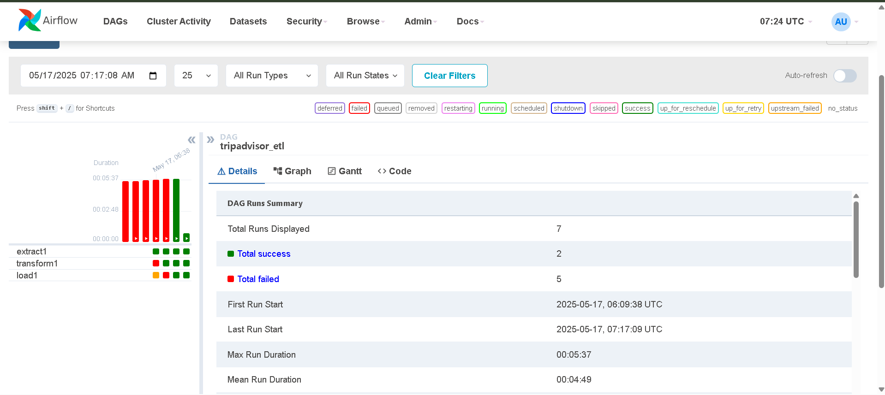
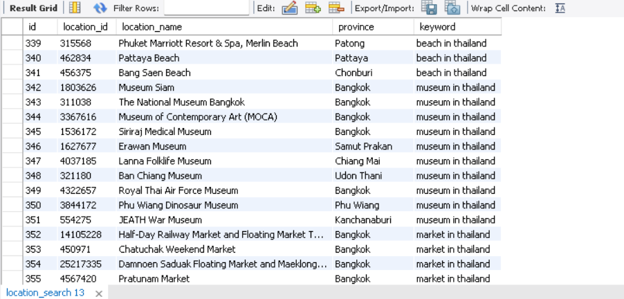

# Building and Orchestrating ETL Pipelines with Apache Airflow

### Overview

I found an API from [TripAdvisor](https://www.tripadvisor.com/developers?screen=metrics) and am interested in building an ETL data pipeline that pulls data from this site. My goal is to extract the top 10 locations for each of 15 popular keywords. 

The project consists of two containers: one running a MySQL server as the database, and the other running Apache Airflow to orchestrate the workflow and automate daily data extraction and updates.

### Architecture
The project is designed as a modular ETL pipeline orchestrated by Apache Airflow and deployed using Docker containers for easy management and scalability.

- **Data Source:** The pipeline extracts data from the TripAdvisor API using 15 popular keywords to retrieve top locations related to each keyword.

- **ETL Scripts:** The ETL process is separated into three main Python scripts/functions:

    - Extract: Responsible for fetching raw data from the API.

    - Transform: Processes and cleans the extracted data to prepare it for loading.

    - Load: Inserts the transformed data into a MySQL database. 

    - **JSON → Python dict → (cleaned/transformed data) → list → MySQL schema**

- **Database:** A MySQL container serves as the persistent storage for all the extracted and transformed data. This setup ensures data consistency and allows easy querying and analysis.

- **Airflow Orchestration:** Apache Airflow manages the workflow by scheduling and executing the ETL tasks according to a defined DAG (Directed Acyclic Graph). The DAG calls the ETL scripts in the order of Extract → Transform → Load, passing data between tasks using Airflow’s XCom mechanism.

### Finally
After several failures and trials, the pipeline was finally completed successfully.

The DAG now runs smoothly — extracting data from the API, transforming it, and loading the cleaned data into the MySQL database.

:)

#### Data collected from TripAdvisor is used strictly for educational purposes only. No commercial use or redistribution intended.